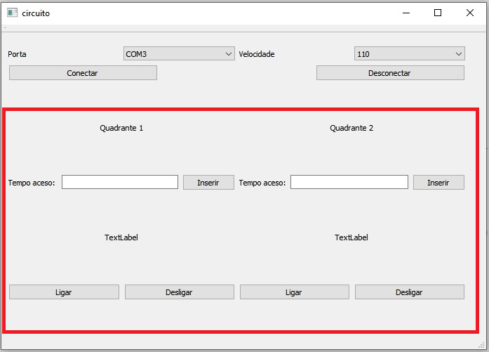
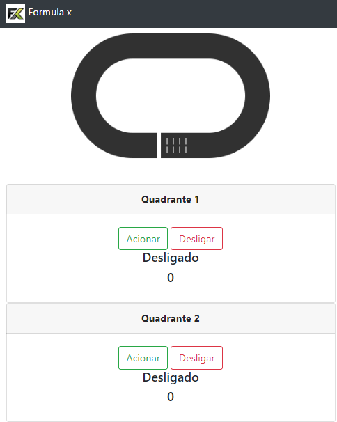

# FormulaX

  ##### Trabalho realizado por:
  ###### Matheus Alexsander de Jesus Nogueira Rodrigues (20182610006)
  ###### Mickael Yoshua Cardoso Reis                    (20182610010)

  

## Sumário

- [Objetivo](#objetivo)
- [Manual do Usuário](#manual-do-usu%C3%A1rio)
- [Como funciona o FormulaX?](#como-funciona-o-formulax)
- [Interface no QT](#interface-no-qt)
- [Interface na Web](#interface-na-web)
- [Informações Técnicas](#informa%C3%A7%C3%B5es-t%C3%A9cnicas)
- [Materiais](#materiais)
- [Circuito](#circuito)
- [Resultados](#resultados)

## Objetivo

O FormulaX é um sistema de monitoriamento da performance com iluminação inteligente. Nesse protópio o usuário poderá analisar a sua perfomace através da análise dos dados gerados a partir de sensor de infravermelho.

## Manual do Usuário

#### Como funciona o FormulaX?

O FormulaX tem como ideia principal um monitoramente dados da performance de um piloto, constintindo em uma melhor análise do seu desempenho e buscando o aperfeiçoamento do mesmo. O FormulaX tem a finalidade da obtenção dos dados, aonde esses dados são monitorados e melhor avaliado por uma equipe técnica.
Para facilitar a obtenção dos dados foi desenvolvido junto com o protótipo uma interface QT e uma interface WEB.

#### Interface no QT

Na interface no Qt podemos manipular as funções do programa. Primeiramente, é necessário identificar a porta serial disponível para o acesso, somente depois de escolher a porta que conecta ao circuito o programa liberará ao usuário todas as outras funções, mas o usuário só terá acesso se a porta escolhida conectar com o circuito, caso não ocorra as outras funções permanecem bloqueadas.

Após configuramos a porta serial COM3, se faz necessário escolher a velocidade de comunicação, que por padrão, deverá ser escolhida 115200.

Para estabelecer a conexão é necessário que os passos anteriores estejam corretamente executados.

Pronto! Após estabelecermos a comunicação, o usuário pode definir o tempo que em o led ficar acesso após a atuação do infravermelho, como também liga-lo e desliga-lo no tempo que jugar necessário.

#### Interface na Web

O [site](https://formulax.herokuapp.com) do FormulaX permite que o usuário tenha acesso ao sistema de monitoramente, necessitando apenas de uma conexão com a web. Esta página web está hospedada no Heroku, uma plataforma cloud que permite o deploy de aplicações para desenvolvedores. 

## Informações Técnicas

#### Materiais

- NodeMCU [ESP8266](https://cdn-shop.adafruit.com/product-files/2471/0A-ESP8266__Datasheet__EN_v4.3.pdf)
- Sensor Infravermelho (3 receptor e 3 emissor)
- Protoboard
- 6 resistores de 220(Ohms), 3 de 1k(Ohms) e 3 de 10k(Ohms).

##### Circuito

##### Interrupção

Utilizar interrupções significa definir um pino para detectar pulsos de tensão. Em nosso circuito utilizamos o parâmetro RISING pois ao interromper o IR(infrared) ocorre um pico de tensão.

Existem alguma peculiaridades no NodeMCU para serem configuradas com o objetivo de fazer o pino de interrupção funcionar corretamente:

-Definir a versão da ESP8266 para 2.5.0 pois as versões mais atualizadas não funcionam com as funções de interrupção;

-Utilizar as funcões attachInterrupt() e digitalPinToInterrupt() assim como definir o pino como INPUT_PULL UP, colocar o prefixo ICACHE_RAM_ATTR ao declarar a função de interrupção (Ex.: void ICACHE_RAM_ATTR interrupt()) e declarar qualquer variável utilizada na interrupção como volatile;

-ICACHE_RAM_ATTR serve para fazer a função rodar na RAM e volatile para assegurar o valor da variável caso utilize interrupções muito rápidas;

-Se utilizar dos pinos D0 a D7 ligar o pino a um resistor(de preferência com uma resistencia alta, como 10kOhms), o resistor ligar no terra e sua interrupção ligar no ponto pino-resistor, pois os pinos quando setados como INPUT_PULLUP e digitalPinToInterrupt() ficam em nivel alto o tempo todo;

##### Funcionamento

Ao declarar um objeto da classe Quadrantes deve-se colocar no construtor os seguintes dados: pino para led, pino para interrupção e tempo que o quadrante permanece aceso.

Toda vez que um objeto interrompem o sinal do infravermelho ocorre um pico de tensão, o NodeMCU lê esse pico de tensão, aciona o quadrante relacionado a esse infravermelho e registra o tempo de interrupção. A partir desse tempo de interrupção entre quadrantes e da distância constante entre eles é calculada a velocidade do objeto.

No QT e no site é possível conferir seus tempos de permanência em nivel alto como também alterá-los. também pode ser visualizado suas velocidades durante o percurso.

###### Timing com a função millis()

Em nosso trabalho necessitamos do uso de uma lógica que segrasse o sinal do led por um tempo e depois liberasse mas sem fazer o resto do programa parar. Com isso em mente foi desenvolvido uma logica utilizando a função millis().
Primeiro é salvo o tempo no momento que ocorreu a interrupção no sensor, em seguida é feita a contagem do tempo logo após salvar o valor nesse momento e quando a diferença de tempo entre o tempo salvo e o tempo decorrido for igual ou maior que o tempo definido para o led permanecer aceso ele apaga. Assim podemos executar exatamente uma aplicação da função delay() sem fazer o programa parar.

#### Resultados

- Circuito funcionou, junto com seu código;
- QT apenas envia JSON com problema na leitura do mesmo;
- Servidor Web lê o JSON e mostra s dados com problema no envio do mesmo.

