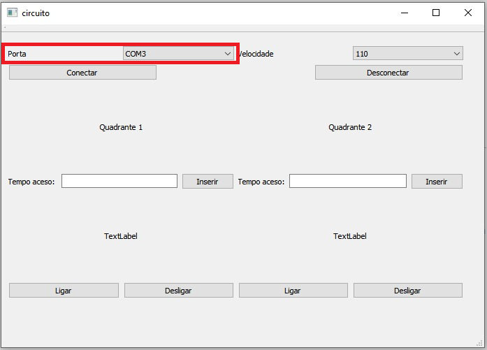
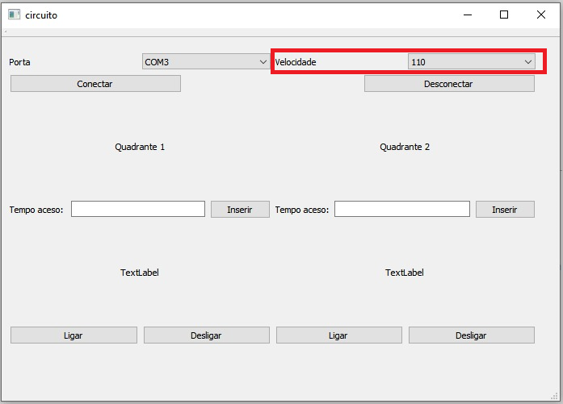
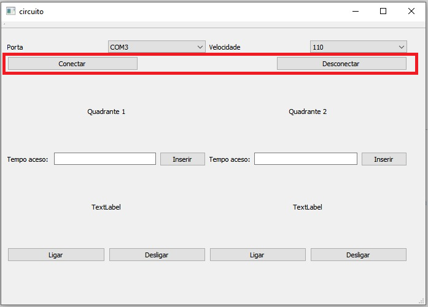
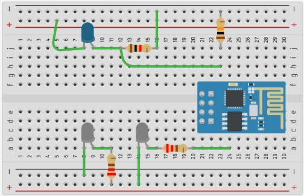

# FormulaX

  

## Sumário

## Introdução

O FormulaX é um sistema de monitoriamento da performance com iluminação inteligente. Nesse protópio o usuário poderá analisar a sua perfomace através da análise dos dados gerados a partir de sensor de infravermelho.

## Manual do Usuário

#### Interface no QT

Na interface no Qt podemos manipular as funções do programa. Primeiramente, é necessário identificar a porta serial disponível para o acesso, somente depois de escolher a porta que conecta ao circuito o programa liberará ao usuário todas as outras funções, mas o usuário só terá acesso se a porta escolhida conectar com o circuito, caso não ocorra as outras funções permanecem bloqueadas.

Após configuramos a porta serial COM3, se faz necessário escolher a velocidade de comunicação, que por padrão, deverá ser escolhida 115200.

Para estabelecer a conexão é necessário que os passos anteriores estejam corretamente executados.

#### Interface na Web

## Informações Técnicas

#### Materiais

- NODEMCU
- Sensor Infravermelho(3 receptor e 3 emissor)
-protoboard
- 6 resistores de 220, 3 de 1k e 3 de 10k

###### Circuito

  
 

